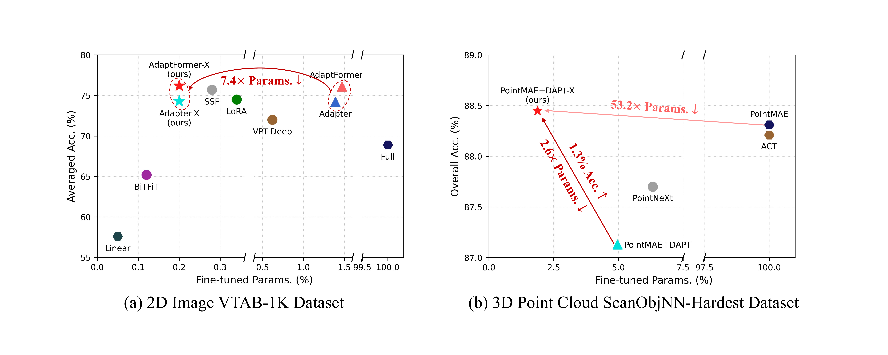
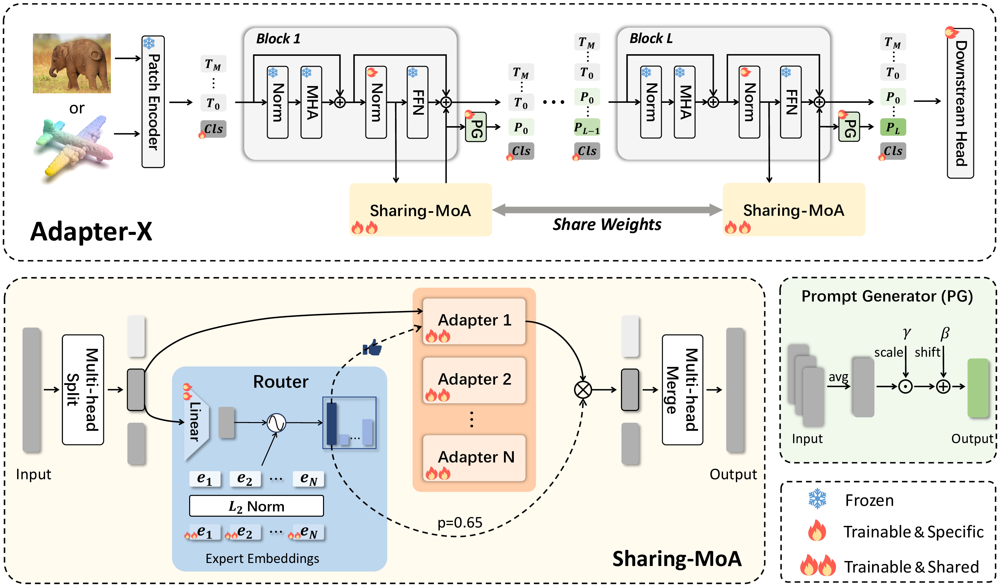

<!-- <div align= "center">
    
    <h1> Official repo for Adapter-X</h1>

</div> -->

<div align="center">
    <h2> <a href="https://arxiv.org/abs/2406.03051">Adapter-X: A Novel General Parameter-Efficient Fine-Tuning Framework for Vision</a></h2>

<p align="center">
  <!-- <a href="https://ch3cook-fdu.github.io/">Project Page</a> • -->
  <a href="https://arxiv.org/abs/2406.03051">Arxiv Paper</a> •
  <!-- <a href="">HuggingFace Demo</a> • -->
  <a href="#-citation">Citation
</p>

</div>

<div align="center">

<!--  -->

<!-- |                                                   Teaser Video                                                   |                                                    Demo Video                                                    |
| :--------------------------------------------------------------------------------------------------------------: | :--------------------------------------------------------------------------------------------------------------: |
| <video src="https://github.com/OpenMotionLab/MotionGPT/assets/120085716/a741e162-b2f4-4f65-af8e-aa19c4115a9e" /> | <video src="https://github.com/OpenMotionLab/MotionGPT/assets/120085716/ae966d17-6326-43e6-8d5b-8562cf3ffd52" /> | -->

</div>

<!-- ### [MeshXL: Neural Coordinate Field for Generative 3D Foundation Models](https://motion-gpt.github.io/) -->
<!-- ### [Project Page](https://motion-gpt.github.io/) | [Arxiv Paper](https://arxiv.org/abs/2306.14795) | [HuggingFace Demo](xxx) -->

## 🏃 Intro Adapter-X

Parameter-efficient fine-tuning (PEFT) has become increasingly important as foundation models continue to grow in both popularity and size. Adapter has been particularly well-received due to their potential for parameter reduction and adaptability across diverse tasks. However, striking a balance between high efficiency and robust generalization across tasks remains a challenge for adapter-based methods. We analyze existing methods and find that: 1) parameter sharing is the key to reducing redundancy; 2) more tunable parameters, dynamic allocation, and block-specific design are keys to improving performance.

Inspired by this insight, we introduce a novel framework named **Adapter-X**. First, a Sharing Mixture of Adapters (SMoA) module is proposed to fulfill token-level dynamic allocation, increased tunable parameters, and inter-block sharing at the same time. Second, some block-specific designs like Prompt Generator (PG) are introduced to further enhance the ability of adaptation. 

Extensive experiments across 2D image and 3D point cloud modalities demonstrate that Adapter-X represents a significant milestone as it is the first to outperform full fine-tuning in both 2D image and 3D point cloud modalities with significantly fewer parameters, i.e., only 0.20% and 1.88% of original trainable parameters for 2D and 3D classification tasks. 



## 🚩 News

- [2024/06/05] Upload paper and init project.

## ⚡ Quick Start

<details>
  <summary><b>Build Environment</b></summary>

</details>

## 💻 Training and Evaluation

<details>
  <summary><b>Training guidance</b></summary>

</details>


## 📖 Citation

If you find our code or paper helps, please consider citing:

```bibtex
@article{li2024adapter,
  title={Adapter-X: A Novel General Parameter-Efficient Fine-Tuning Framework for Vision},
  author={Li, Minglei and Ye, Peng and Huang, Yongqi and Zhang, Lin and Chen, Tao and He, Tong and Fan, Jiayuan and Ouyang, Wanli},
  journal={arXiv preprint arXiv:2406.03051},
  year={2024}
}
```

## Acknowledgments

Thanks to these amazing works: NOAH, Bi-adapter, DAPT, Switch Transformer and X-MoE.
